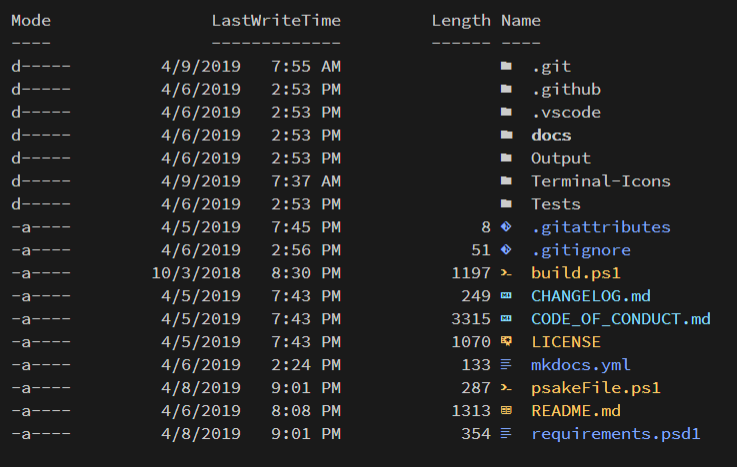

# Terminal-Icons

PowerShell module to show file and folder icons in the terminal.

| Azure Pipelines | PSGallery | License |
|-----------------|-----------|---------|
[![Azure Pipelines Build Status][azure-pipeline-badge]][azure-pipeline-build] | [![PowerShell Gallery][psgallery-badge]][psgallery] | [![License][license-badge]][license]

## Overview

> This is very much a work in progress. This means the structure and functionality will most likely change prior to release. Right now, it just BARELY works. *USE AT YOUR OWN RISK*.

*Terminal-Icons* is a PowerShell module that adds file and folder icons when displaying items in the terminal.
This relies on the custom fonts provided by [Nerd Fonts](https://github.com/ryanoasis/nerd-fonts).

> You must be using one of the fonts provided by Nerd Fonts for this module to work as these fonts include tons of custom glyphs/icons that are referenced by their unicode number.

It uses a custom [format.ps1xml](https://docs.microsoft.com/en-us/powershell/module/microsoft.powershell.core/about/about_format.ps1xml?view=powershell-6) file that inspects the items being displayed and looks up their appropriate icon based on name or extension.
Icons for well-known files/folders are attempted to be used first before displaying an icon based on the file extension.
Any files/folders that are not matched are shown using a generic file or folder icon.

## Usage

```powershell
Get-Item ./README.md

Get-ChildItem

Get-ChildItem | Format-List

Get-ChildItem | Format-Wide
```

## Screenshots

```powershell
Get-ChildItem -Path . -Force
```



## Contributions

TODO

[azure-pipeline-badge]: https://dev.azure.com/devblackops/Terminal-Icons/_apis/build/status/devblackops.Terminal-Icons?branchName=master
[azure-pipeline-build]: https://dev.azure.com/devblackops/Terminal-Icons/_build/latest?definitionId=6&branchName=master
[psgallery-badge]: https://img.shields.io/powershellgallery/dt/terminal-icons.svg
[psgallery]: https://www.powershellgallery.com/packages/terminal-icons
[license-badge]: https://img.shields.io/github/license/poshbotio/poshbot.svg
[license]: https://www.powershellgallery.com/packages/poshbot
