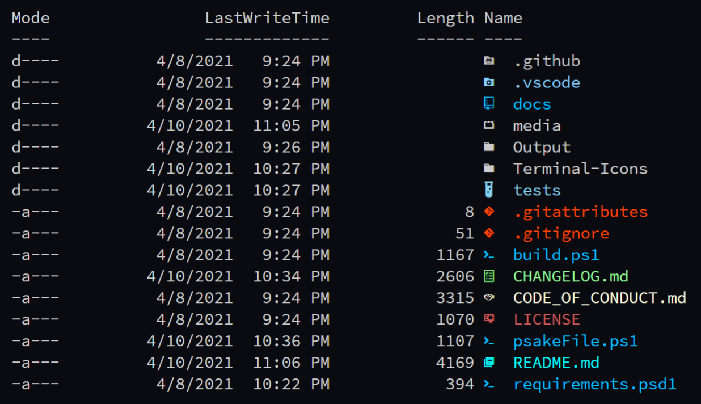

# Terminal-Icons

A PowerShell module to show file and folder icons in the terminal.

| GitHub Actions | PSGallery | License |
|----------------|-----------|---------|
[![GitHub Actions Status][github-actions-badge]][github-actions-build] | [![PowerShell Gallery][psgallery-badge]][psgallery] | [![License][license-badge]][license]

<p align="center">
    
</p>

## Overview

*Terminal-Icons* is a PowerShell module that adds file and folder icons when displaying items in the terminal.
This relies on the custom fonts provided by [Nerd Fonts](https://github.com/ryanoasis/nerd-fonts).

> You must be using one of the fonts provided by Nerd Fonts for this module to work as these fonts include tons of custom glyphs/icons that are referenced by their unicode number.

## How Does this Work?

It uses a custom [format.ps1xml](https://docs.microsoft.com/en-us/powershell/module/microsoft.powershell.core/about/about_format.ps1xml?view=powershell-6) file that inspects the items being displayed and looks up their appropriate icon based on name or extension.
Icons for well-known files/folders are attempted to be used first before displaying an icon based on the file extension.
Any files/folders that are not matched are shown using a generic file or folder icon.

## Installation

To install the module from the [PowerShell Gallery](https://www.powershellgallery.com/):

```powershell
Install-Module -Name Terminal-Icons -Repository PSGallery
```

You can also install it from [Scoop](https://scoop.sh/):
```powershell
scoop bucket add extras
scoop install terminal-icons
```

## Usage

```powershell
Import-Module -Name Terminal-Icons

Get-Item ./README.md

Get-ChildItem

Get-ChildItem | Format-List

Get-ChildItem | Format-Wide
```

## Commands

| Command | Description
|---------|-------------|
Add-TerminalIconsColorTheme | Add a Terminal-Icons color theme for the current user.
Add-TerminalIconsIconTheme  | Add a Terminal-Icons icon theme for the current user.
Format-TerminalIcons        | Prepend a custom icon (with color) to the provided file or folder object when displayed.
Get-TerminalIconsColorTheme | List the available color themes.
Get-TerminalIconsIconTheme  | List the available icon themes.
Get-TerminalIconsTheme      | Get the currently applied color and icon theme.
Remove-TerminalIconsTheme   | Removes a given icon or color theme.
Set-TerminalIconsColorTheme | **DEPRECATED** Set the Terminal-Icons color theme.
Set-TerminalIconsIconTheme  | **DEPRECATED** Set the Terminal-Icons icon theme.
Set-TerminalIconsTheme      | Set the Terminal-Icons icon and/or color theme.
Show-TerminalIconsTheme     | List example directories and files to show the currently applied color and icon themes.

## Screenshots

```powershell
Get-ChildItem -Path . -Force
```



## Tips

If using the default console in Windows and not something like VSCode, ConEmu, Terminus, etc., you may have issues getting a nerd font to be recognized correctly.
Try following this [quick guide](https://gist.github.com/markwragg/6301bfcd56ce86c3de2bd7e2f09a8839) by [Mark Wragg](https://twitter.com/markwragg).
[Issue #269](https://github.com/ryanoasis/nerd-fonts/issues/269) on Nerd Fonts has more information.

## Contributions

Any ideas on how to improve this module are welcome.
If you have ideas for an appropriate [glyph](http://nerdfonts.com/#cheat-sheet) to display for a well-known folder or file, or a particular file extension, please raise an [issue](https://github.com/devblackops/Terminal-Icons/issues/new).
If you'd like to submit an entirely new color or icon theme, take a look at the existing ones [here](https://github.com/devblackops/Terminal-Icons/tree/master/Terminal-Icons/Data/colorThemes) and [here](https://github.com/devblackops/Terminal-Icons/tree/master/Terminal-Icons/Data/iconThemes), create your new file(s) named what ever you like, and submit a pull request.

[github-actions-badge]: https://github.com/devblackops/Terminal-Icons/workflows/CI/badge.svg
[github-actions-build]: https://github.com/devblackops/Terminal-Icons/actions
[psgallery-badge]:      https://img.shields.io/powershellgallery/dt/terminal-icons.svg
[psgallery]:            https://www.powershellgallery.com/packages/terminal-icons
[license-badge]:        https://img.shields.io/github/license/poshbotio/poshbot.svg
[license]:              https://www.powershellgallery.com/packages/poshbot
